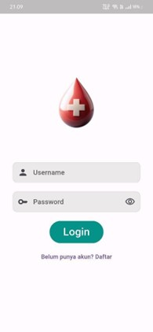
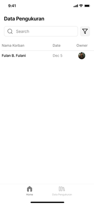

# 🧬 Forensic Wound Measurement System using Computer Vision and Machine Learning

  
  
  
   
  
  
  

A Python-based system developed as a final year undergraduate thesis (2023–2024), focusing on wound measurement in forensic cases using image processing and machine learning.

## 📄 Journal Publication of The Research Project

## 🎥 Project Demo Video

## 🔍 Project Overview

This project aims to measure wound dimensions (length, width, and depth) from forensic imagery in collaboration with Bhayangkara Hospital Yogyakarta. It consists of two main measurement components:

- **Length & Width Estimation:**  
  Utilizes ArUco markers to convert image pixels into metric units. Two modes are available:  
  - **Manual Mode:** Users draw a line across the wound to get the measurements.  
  - **Automatic Mode:** Measurements are detected automatically without user input.

    

- **Depth Estimation:**  
  Uses Pressure Ulcer classification standards and applies Support Vector Machine (SVM) algorithms for classifying wound depth based on image features.
  **Note:** Feature extraction in this model can be expanded further by incorporating additional visual features such as color histograms, texture descriptors (e.g., LBP, GLCM), edge sharpness, and shape metrics to improve classification accuracy.

    

### 🎯 Key Features:
- **Collaboration:** Developed with support from Bhayangkara Hospital, Yogyakarta.
- **Measurement Modes:**
  - Manual interaction (drawing line annotations)
  - Fully automatic wound detection
- **Reference Calibration:** Aruco markers used for real-world scaling
- **Machine Learning:**
  - Depth classification using SVM based on Pressure Ulcer stages
- **Practical Application:** Forensic and medical investigation aid

⚠️ **Note on Data Privacy:**  
The dataset used in this project **cannot be shared** due to **ethical and medical privacy regulations** regarding sensitive patient data.

## 🛠️ Technical Implementation

| 🔧 Component            | 💻 Implementation                          |
|-------------------------|-------------------------------------------|
| Image Processing        | OpenCV, Aruco Marker Detection            |
| Automatic Measurement   | Contour Detection, Object Detection        |
| Depth Classification    | scikit-learn (SVM model)                  |
| Data Labeling           | Pressure Ulcer Stage Classification       |
| Visualization           | real-world scaled outputs     |
